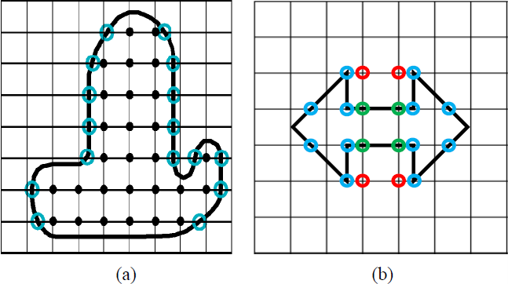
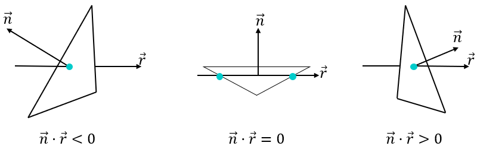
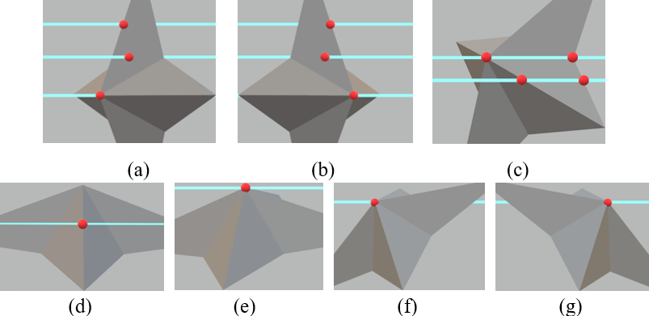
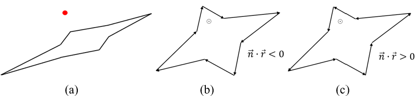
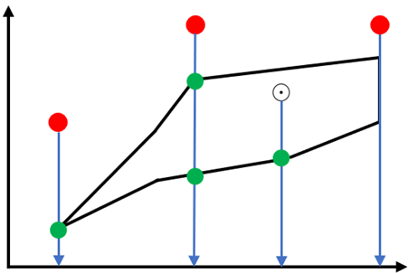
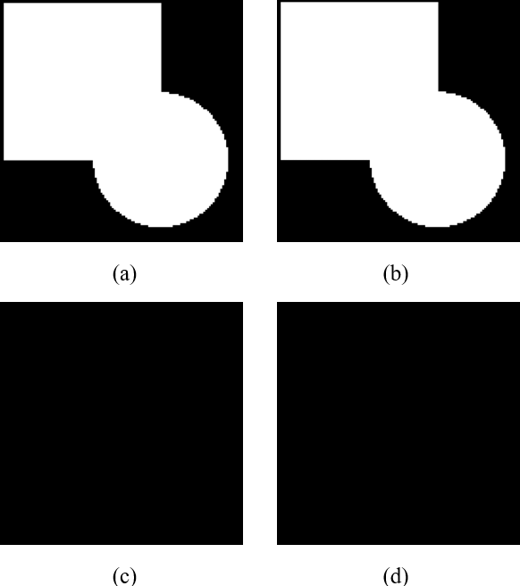

# Gaussian-Voxelizer
To compile: 
　　./compile.sh 
Run demo: 
　　./demo.sh 
Display parameter info 
　　./gv 
You need to use image viewer tool like Fiji to view the output .raw file. 

# Report

    

<h2 align='center'>
    Gaussian Voxelization with Ray-Mesh Intersection Point Classification Method
</h2>
<h3 align='center'>
Supervisor: Yukiko Kenmochi 
Reporter: Yiheng Zhang 
02/10/2018
</h3>

## Abstract

This paper presents a Gaussian voxelization algorithm for manifold and
water-tight polygon mesh.

Firstly, a ray casting method is used to locate ray-mesh intersection points,
the rays are parallel to an axis and cross voxel centers. Secondly, we tag these
intersection points along each ray by analyzing the dot production(s) of the ray
and corresponding surface(s) normal. Finally, voxels along each ray would be
validated based on the sequence and tags of the intersection points.

Our implementation and result shows that this algorithm can perform Gaussian
voxelization which is solid, geometrically and topologically correct when given
appropriate voxel size.

**Keywords:** Gaussian voxelization, ray-mesh intersection

## Introduction

The 3D discrete space is represented as a set of grid points such as integer
Cartesian coordinates (x, y, z) in 3D Euclidean space. The voxel is a unit cubic
volume that centered at the integral grid point. In 3D image processing, the
voxelization is to convert an object from its continuous geometric
representation into an approximate discrete volumetric representation. We
commonly assign 0 to voxels who represents transparent background in the space,
for those who are given non-0 values are representing opaque objects. The value
could be a dynamic range that can represent either partial coverage, variable
densities, or graded opacities. In this paper, the non-0 voxels are all assigned
to 1 and called validated voxels.

The resulting data structure of voxelization is useful in numerous fields. In
game industry, voxels can be used in global illumination, collision detection or
terrain simulation. In medicine, voxel dataset usually stores volumetric image
that acquired by a CT or MRI scanner. Voxel set can be visualized as polygon
mesh by extracting its iso-surfaces, sometimes, the scientists would like to
make a study of how to keep both geometric and topology of the original voxel
set after voxelizing the moved, rotated polygon mesh. Therefore, Gaussian
voxelization algorithm is needed to produce accurate volumetric representation
of the polygon mesh.

There are multiple algorithms and applications that perform fast and approximate
voxelization, they either do only surface voxelization or could not guarantee
the accuracy that causes unexpected lost or emergence of voxel(s). In this
paper, we studied and borrowed two main ideas, ray-triangle intersection
processing and general voxelization scheme from existing algorithms, and then
come up with our gaussian voxelization algorithm.

## Related work

Fakir S. Nooruddin and Greg Turk proposed a ray casting method called “parity
count” to solve point-in-polygon problem for non-watertight mesh [1]. The idea
is to count the number of times that a ray launched by the voxel center
intersects the polygon mesh. An odd number of intersections means the voxel is
inside of the model, an even number indicates the voxel is outside. In essence,
the rays are parallel and casted on a plane of two axes. The rays go through the
mesh and each of them would identify all the voxels along the ray.

     
    <strong>Fig1. (a)</strong> A profile of an object that voxelized by parity count. Direction
of rays is from left to right, black dots are voxels inside mesh, while other
voxels are outside mesh, blue circles are ray-mesh intersection points. <strong>(b)</strong> The
ambiguity of counting intersections on vertex or polygon surface. Blue circles
are intersection points, red circles are unwanted extra voxels, green circles
are unwanted lost voxels.

Usually, the voxelization like Fig1.a works fine with parity count. At initial
state, all voxel counting values are 0. Along each ray (horizontal line), for each intersection point (the blue circle), all voxel values behind would
increase 1, then the interior voxels’ value are all odd numbers and outside
voxels’ value are all even numbers. However, the situation like Fig1.b is not
neglectable, but Fakir S. Nooruddin and Greg Turk didn’t explain how would
parity count work with intersection points on the mesh vertices or surfaces. The
idea of ray casting inspired our further works.

For a triangle mesh, in order to get ray-mesh intersection points, we need to
process triangle by triangle. Michael Schwarz and Hans-Peter Seidel proposed a
method to process each triangle by projecting the triangle into origin plane of
rays and iteratively check if ray’s origin is covered by projected triangle in
the range of projected triangle’s bounding box [2]. We also inserted this
procedure into our algorithm.

## Gaussian voxelization

To avoid the problem of parity count, we suggest to classify all intersection
points and validate voxels based on the points tag along each ray to achieve
Gaussian voxelization. We define four intersection point tags which are “enter”,
“exit”, “touch_start” and “touch_end”. We also need to define three ray-triangle
intersection cases like Fig2, using the sign of the dot product of a ray and
intersected triangle’s normal.

     
    <strong>Fig2.</strong> Ray-triangle intersection cases.

An intersection point could be shared by multiple triangles when it is on the
edge or vertex of the triangle, therefore, we need to analyze all intersection
cases of a point before tagging it.

     
    <strong>Fig3.</strong> General conditions of ray-mesh intersection, ray direction from left to right, red dots are intersection points.

We use “T” to represent a set of triangles that are sharing an intersection
point and “t” to represent the triangle in “T”. By observing the example Fig3.a,
we can easily conclude that these three intersection points should be tagged as
“enter” while they satisfy 
$$
\forall t \in T,\ \overrightarrow{n_{t}} \overrightarrow{r} < 0
$$
Similarly, the three intersection points in Fig3.b
should be tagged as “exit” while they satisfy
$$
\forall t \in T,\ \overrightarrow{n_{t}} \overrightarrow{r} > 0
$$
For the four intersection
points in Fig3.c, they satisfy
$$
\exists t \in T,\overrightarrow{n_{t}} \overrightarrow{r} = 0
$$
the left two points would have the tag “touch_start”
and the right two points would contain the tag “touch_end”. There is a triangle
processing trick, when
$$
\overrightarrow{n_{t}} \overrightarrow{r} = 0
$$
and there is only one intersection point and the point is one of the triangle
vertices, we don’t tag anything and continue to process next triangle. The
reason to do this trick is that we need the point with tag “exit” or “exit” and
“touch_end” to stop voxel validation along the ray.

The Fig3.d, Fig3.e, Fig3.f, Fig3.g all satisfy that
$$
(\exists t \in T,\overrightarrow{n_{t}} \overrightarrow{r} < 0) \land
(\exists t \in T,\overrightarrow{n_{t}} \overrightarrow{r} > 0) \land
(\exists t \in T,\overrightarrow{n_{t}} \overrightarrow{r} = 0)
$$
However, the intersection point in Fig.d would be fixed as “enter” and “exit” and shared by two triangles. For conditions like Fig3.e, Fig3.f and Fig3.g, the further classification is
needed.

     
    <strong>Fig4.</strong> The rays’ origin plane projection of the intersection point and its opposite edges in related triangles. (a) Projection of Fig3.e; (b) Projection of Fig3.f; (c) Projection of Fig3.g, the circled dot means ray is vertical to the paper and going out.

     
    <strong>Fig5.</strong> General conditions of ray-shape intersection, red dots and circled dots are projected intersection points, green dots are ray-shape intersection point.

Because of the existing condition
$$
(\exists t \in T,\overrightarrow{n_{t}} \overrightarrow{r} = 0)
$$
tag “touch_start” and “touch_end” are not enabled
now, then after the projection as Fig4., the projected intersection point would
only be interior or exterior to the projected shape, therefore, if the point is
outside the shape, we can easily identify the condition Fig3.e. To do this
classification, we propose a variant of parity count method. Take Fig5. for
example, on the projected plane, we cast a ray from the projected intersection
point to the opposite direction of an axis, if the ray is on an edge, we
collapse this edge and recast the ray. When there is an intersection point on
the vertex, if the ray is between two related edges, we count one on this point,
otherwise, we count two. When the intersection point is on the edge, we count
one. If the sum of counts is odd, the projected intersection point is inside the
shape, otherwise, it’s outside. Another special case is that projected edges
have overlaps and the shape is not closed, then the projected intersection point
is outside the shape.

For the projected intersection point inside shape, if the dot production of the
shape’s normal and the ray in 3D is less than 0, remove the tag “exit” from the
intersection point, if the dot production is bigger than 0, then remove “enter”
instead.

By now, the intersection points tagging processing is done, the voxel validation
process along each ray starts from the smallest intersection point with tag
“enter” and not “exit” until meet the closest point with tag “exit” and not
“enter” and not “touch_start”. If the next intersection point contains tag
“touch_start”, then validate voxels behind until meet the point that contains
tag “touch_end”. If the next intersection point’s tags are “enter” and “exit”,
the voxel is validated when the intersection point is the voxel center. We
iteratively validate voxels along the rays using previous steps, then a new
voxel dataset is created.

The full algorithm is put in the appendix.

## Implementation and result

     
    <strong>Fig6.</strong> (a) profile with z = 63 of original voxel set with size 128*128*128; (b) profile with z = 63 of gaussian voxelized new voxel set; (c) subtraction of original voxel set and new voxel set; (d) subtraction of new voxel set and original voxel set.

The program is written in C++ with boost library included. In order to avoid
inaccurate calculations caused by precision limitations of float and double
type, the boost rational type is used to participate all mathematical
calculations. After implementing voxelization, we subtract original voxel set
with new voxel set, the window shows as Fig6.c which indicate no voxel is lost.
Later we subtract new voxel set with original voxel set, the window shows as
Fig6.d which means no extra voxel is created. By now, from algorithm to
implementation, we have achieved gaussian voxelization.

There are two feasible features that can improve the program in the future. The
program can be boosted by using multithread processing when processing the
triangles of the mesh. The voxel data can be stored in bitwise or octree to
reduce the data volume.

## References

1.  Fakir S. Nooruddin and Greg Turk, “Simplification and Repair of Polygonal
    Models Using Volumetric Techniques”, *IEEE Translation Visualization and
    Computer Graphics*, vol. 9, NO. 2, April-June 2003

2.  Michael Schwarz and Hans-Peter Seidel, “Fast Parallel Surface and Solid
    Voxelization on GPUs”, *ACM Translation on Graphics*, 29, December 2010

## Appendix

**Algorithm:** Gaussian_Voxelization 
**Input:** mesh = (Vertex, Face); space size $S_{\text{minx}}$,
$S_{\text{miny}}$, $S_{\text{minz}}$, $S_{\text{maxx}}$,
$S_{\text{maxy}}$, $S_{\text{maxz}}$; number of voxels for x-axis, y-axis
and z-axis $N_{x}$, $N_{y}$, $N_{z}$; ray direction d. 
**Output:** voxelset 
**initialization** 
**for** each f ∈ Face 
　　normal $:=$ FACE_NORMAL (f) 
　　dot_production $:=$ RAY_NORMAL_DOT_PRODUCTION (normal, d) 
　　rayset $:=$ RAY_RAYSET (f, d) // find the set of rays going through f with
direction d 
**for** each $\text{ray} \in \text{rayset}$ 
　　point.value $:=$ FIND_INTERSECTION (f, ray) 
　　//if dot_production = 0, return first and last point value 
　　//if first point.value equals to last point.value, jump to next loop 
**if** dot_production < 0 
　　**then** point.enter $:=$ true 
**else if** dot_production > 0 
　　**then** point.exit $:=$ true 
**else if** dot_production = 0 
　　**then** point.touch_start $:=$ true,
point.touch_end $:=$ true 
**if** point $\notin$ intersection_list 
　　**then** insert point into intersection_list by point.value increasing order 
**else** locate point in intersection_list 
　　intersection_list.point.enter $:=$ intersection_list.point.enter **or**
point.enter 
　　intersection_list.point.exit $:=$ intersection_list.point.exit **or**
point.exit 
　　intersection_list.point.touch$\  :=$ intersection_list.point.touch **or**
point.touch 
**for** each ray in direction d 
　　**while** intersection_list is not empty 
　　　　**for** each point $\in$ intersection_list 
　　　　　　**if** point.shared_triangles $\geq$ 3 
　　　　　　　　**if** point.enter = true **and** point.exit = true **and** point.touch_start = false 
　　　　　　　　project point and point’s opposite edges of all shared triangles into plane of
ray’s origin 
　　　　　　　　**if** projected point is not outside the polygon of projected edges 
　　　　　　　　　　**if** RAY_NORMAL_DOT_PRODUCTION (polygon_normal, d) \> 0 
　　　　　　　　　　　　**then** point.enter $:=$ false 
　　　　　　　　　　**else** point.exit $:=$ false 
**for** each ray in direction d 
　　**while** intersection_list is not empty 
　　　　**for** each point $\in$ intersection_list 
　　　　　　**if** point.enter = true **and** point.exit = false 
　　　　　　　　**then** start_value = point.value 
　　　　　　　　**while not** (point.enter = false **and** point.touch_start = false **and** point.exit = true) 
　　　　　　　　　　move to next point 
　　　　　　　　　　end_value = point.value 
　　　　　　　　**for** each voxel_center $\in$ [start_value, end_value] 
　　　　　　　　　　voxel = 1 
　　　　　　**else if** point.touch_start = true 
　　　　　　　　start_value = point.value 
　　　　　　　　move to next point 
　　　　　　　　end_value = point.value 
　　　　　　　　**for** each voxel_center $\in$ [start_value, end_value] 
　　　　　　　　　　voxel = 1 
　　　　　　**else if** point.enter = true **and** point.exit = true **and** point.value = voxel_center 
　　　　　　　　**then** voxel = 1 
**return** voxelset